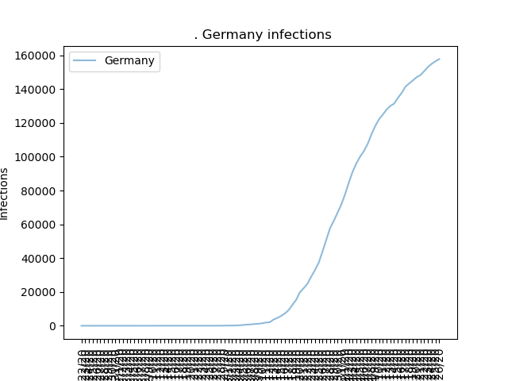
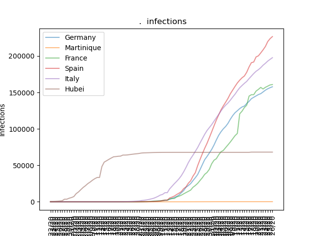
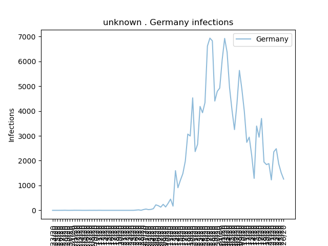
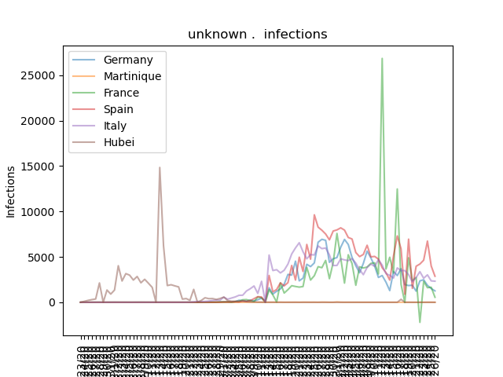

# Description

Panalize is a simple script that draws infection data into
diagrams. It uses the data from the CSSE dataset of the Johns Hopkins
University. The dataset is distributed via [their git repository](https://github.com/CSSEGISandData/COVID-19.git).

## IDS

An IDS - Infections Data Set - does contain data about confirmed
infections on a larger scale. This could be the world with details per
contry or a country with details on the regions.

## SIDS

An SIDS - Specific Infections Data Set - does contain data about
confirmed infections limited to a specific set of infections data.

# Demo

First of all, lets define, where the .csv files, that contain the
Dataset, are located.

    DATASET = "<somefolder>/csse_covid_19_time_series/time_series_covid19_confirmed_global.csv"

To setup things one must create an IDS object

    world = IDS(DATASET)

Now one can add SIDS objects of countries:

    de = world['Germany']
    it = world['Italy']
    fr = world['France']
    fr.selectRegions(['Martinique'], include_mainland=True)
    es = world['Spain']
    cn = world['China']
    cn.selectRegions(['Hubei'])

For some countries the dataset contains detail informations of the
countries regions. Regional data can be either from within the country
as it is the case with China. These regions can be selected with the
`.selectRegions` method supplied with the list of regions to be selected:

    cn = world['China']
    cn.selectRegions(['Hubei'])

If a country has regions around the world, like eg. France does, the
mainlands data is marked with an empty region field. Here regions and
the mainland can be selected like so:

    fr = world['France']
    fr.selectRegions(['Martinique'], include_mainland=True)

One can now show the cummulated infection count of one of the above
defined countries like so: 

    data = de

As SIDS can be added together, the graph of multiple countries can
created via:

    data = (de + fr + es + it + cn)

The daily new infections graph of one country can be showed via:

    from Filter import dailyNew
    
    data = dailyNew(de)

Again the filter function can be applied so that the countries daily
new infections can be calculated via:

    from Filter import dailyNew
    
    data = dailyNew(de + fr + es + it + cn)

